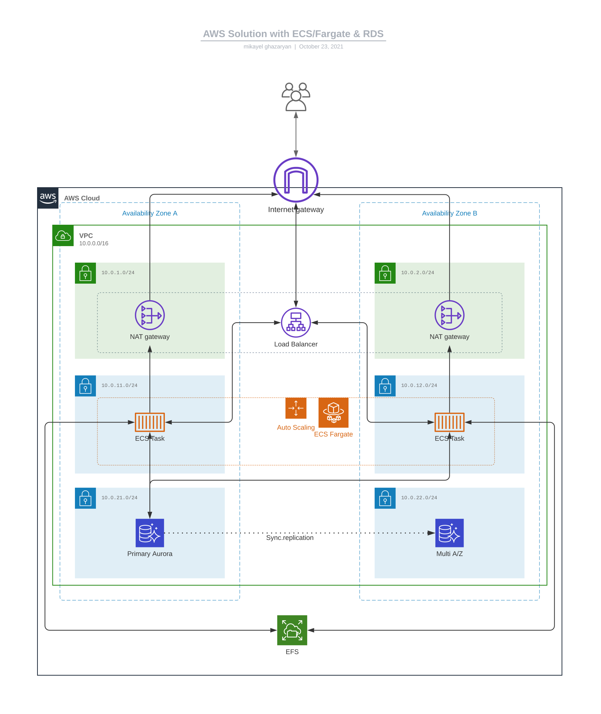

# AWS ECS/Fargate + RDS/Serverless

This project is inspired by Udemy Course ["Amazon ECS & Fargate Master Class" by Stephane Maarek & Gerd König](https://www.udemy.com/course/aws-ecs-fargate/). 

## Architecture

 

As you can see on the diagram this code would bootstrap VPC network spread across 2 Availability Zones, with 3 subnets:
* Public
* Private
* Database

In Public subnet we will set up Application Load Balancer, which spans over 2 A/Zs.

In Private subnet we will place ECS Cluster, where ECS tasks would be running. 
We will register our ECS Service as a Target Group for Application Load Balancer.
AWS ECS Service is set up in a way, that it allows 200% of containers running at the same time, 
which will allow us to do rolling deployments of new containers if we will need to update them.
We will create an EFS parition, which would be attached to ECS tasks.

Database would be spinned up in dedicated database subnet, which will allow traffic only from private subnet and dedicated lambda.
Database credentials would be generated automatically and stored in Secrets Manager, and shared with ECS task and Lambda in a secure way. 

## Deployment

‼️ If you will deploy this project expect that some charges from AWS can occur: NAT Gateway, ECS tasks and RDS database.

### Prerequisites

To deploy this project succesfully you will need to have installed on your machine:
* terraform (v1.0.7) 
* python3 (preferrable 3.8)
* ~/.aws/[config|credentials] should contain correct profile information for your AWS account.

Note: You can use [tfenv](https://github.com/tfutils/tfenv) command line tools to manage terraform versions respectively.

### Deployment

Please make sure you've exported right AWS_PROFILE shell variable.
Please adjust project name and environment variables, depending on your needs.

After which you can use make commands from project's root folder.
To deploy whole infrastructure and have running Wordpress blogging platform you will need to initialize terraform first,
for that please use:

`terraform init`

After which you will be ready to deploy project to your AWS account with command:

`terraform plan`

and 

`terraform apply`

After approximately 15-16 minutes deployment would be done, and you can find DNS name of Application Load Balancer in the output (alb_dns_name), or in AWS Web Console / EC2 / Load Balancers. It should look like this: http://wp-blog-dev-alb-XXXXXXXX.us-east-1.elb.amazonaws.com/ and you should be able to access the deployed website in your browser.

If you need to tear everything down use:

`terraform destroy`

If you want to completely get rid of everything make sure to manually delete remaining CloudWatch Log Groups. 

### Created AWS Services

Following AWS Services would be created:
* VPC
  * Subnets
  * Route Tables
  * Internet Gateway
  * Elastic IP
  * NAT Gateway
  * Security Groups
  * Network ACL
  * VPC Endpoint (SecretsManager)
  * VPC Flow logs CloudWatch group 
* ALB
  * Target Group
  * Listener
* ECS
  * ECS Cluster
  * ECS Service
  * ECS Task Definition
  * ECS Autoscaling policy
  * IAM roles and policies:
    * Task
    * Task Execution
    * Access to Secret Manager
* EFS Filesystem
  * EFS Access point
  * EFS Mount target
* RDS
  * Aurora Serverless cluster
  * Secret stored AWS Secret Manager
* Lambda

---
Further Improvements:
- Review IAM roles and tighten Security Groups, to allow traffic only from respective Security Groups.
- Create CloudWatch Dashboards and Alerts, setup SNS to deliver alerts to email.
---
Enjoy & have fun!
